#  Real-Time Trading Platform for Forex & Cryptocurrency Markets

A modern web-based educational trading platform that enables users to **learn, analyze, and practice trading** in both **Forex** and **Cryptocurrency** markets within a single integrated environment.

Unlike traditional trading platforms that mainly focus on executing trades, this platform combines **financial education, paper trading, real-time market data, Artificial Intelligence, portfolio management, financial news, and market analysis** into one complete system.

---

#  Project Objectives

The primary objective of this platform is to provide an educational environment where users can:

- Learn financial trading concepts.
- Practice trading without risking real money.
- Analyze real-time market data.
- Improve trading skills through practical experience.
- Use Artificial Intelligence to better understand trading decisions.
- Access all essential trading tools within a single platform.

---

#  Key Features

- Real-Time Cryptocurrency Market
- Real-Time Forex Market
- Paper Trading
- AI Trading Assistant
- AI Trade Review
- AI Market Insight
- Cryptocurrency Wallet
- Portfolio Allocation
- Leaderboard
- Financial News
- Economic Calendar
- Learning Modules
- Quiz & Certificate
- Risk Management Calculator
- Real-Time Charts
- Secure Backend API
- Responsive Desktop Interface

---

#  Features

##  Cryptocurrency Market

The Cryptocurrency module provides a realistic paper trading environment together with educational resources.

###  Crypto Dashboard

- Live cryptocurrency prices
- Interactive TradingView charts
- Market overview
- Trading dashboard
- Real-time market monitoring

---

###  Crypto Trading

Users can:

- Buy cryptocurrencies
- Sell cryptocurrencies
- Simulate trades
- Monitor active positions
- Track trading performance

---

###  Trade Management

- Open Positions
- Trade History
- Profit & Loss Tracking

---

###  Artificial Intelligence

#### AI Trading Assistant

An educational AI chatbot that answers questions related to:

- Cryptocurrency
- Technical Analysis
- Fundamental Analysis
- Risk Management
- Trading Concepts
- Trading Strategies

---

#### AI Trade Review

Analyzes the trading parameters entered by the user before opening a trade.

The AI evaluates:

- Entry Price
- Position Direction
- Take Profit
- Stop Loss

and provides educational feedback and suggestions.

---

#### AI Market Insight

Provides AI-generated market analysis based on the currently selected cryptocurrency chart, helping users better understand current market conditions.

---

###  Wallet

The Wallet module allows users to monitor their cryptocurrency holdings.

Features include:

- Current Holdings
- Purchase Price
- Current Value
- Quantity Owned
- Largest Holding
- Portfolio Allocation (%)

---

###  Leaderboard

Compare trading performance with other registered users.

Statistics include:

- Account Balance
- Profit
- Win Rate

---

###  Financial News

Real-time cryptocurrency news.

Users can:

- Read articles
- Search news
- Filter news
- Save favorite articles
- View publication time

---

###  Learning Module

Educational content designed for cryptocurrency beginners and intermediate traders.

Includes:

- Learning Materials
- Interactive Lessons
- Quiz
- Progress Tracking
- Downloadable Certificate

---

#  Forex Market

The Forex module provides a complete paper trading environment with real-time market data.

---

##  Forex Trading

Features include:

- Live Forex prices
- Interactive TradingView charts
- Daily Market Statistics

---

##  Trading Panel

Supports:

- Market Orders
- Buy Limit Orders
- Sell Limit Orders
- Take Profit
- Stop Loss

---

##  Risk Management Calculator

Integrated Position Size Calculator helps traders calculate the appropriate position size based on their risk management strategy.

---

##  Trade Management

- Open Positions
- Pending Orders
- Trade History

---

##  Artificial Intelligence

### AI Trading Assistant

Educational chatbot for Forex trading.

### AI Trade Review

Reviews Forex trading parameters before opening a position and provides educational feedback.

---

##  Economic Calendar

Displays upcoming economic events.

Filtering options include:

- Country
- Impact Level
- Top 20 Economies

---

##  Forex News

Real-time financial news.

Features:

- Search
- Filters
- Save Articles
- Read Articles

---

##  Learning Module

Forex educational content including:

- Learning Materials
- Quiz
- Progress Tracking
- Downloadable Certificate

---

#  Technologies Used

## Frontend

- React.js
- JavaScript
- HTML5
- CSS3

## Backend

- Express.js

## Database & Authentication

- Firebase Authentication
- Firebase Firestore Database

## APIs & Services

- TwelveData API
- TwelveData WebSocket
- NewsAPI
- Finnhub API
- Groq AI API
- Binance API

## Widgets

- TradingView Advanced Chart Widget
- TradingView Economic Calendar Widget


## Cloud & Deployment

- Firebase Hosting
- Render

## Development Tools

- Visual Studio Code
- Git
- GitHub
- Firebase Console

---

#  System Architecture

The application follows a modern client-server architecture.

- React Frontend
- Firebase Authentication
- Firebase Firestore Database
- External Financial APIs
- TradingView Widgets
- Artificial Intelligence Services

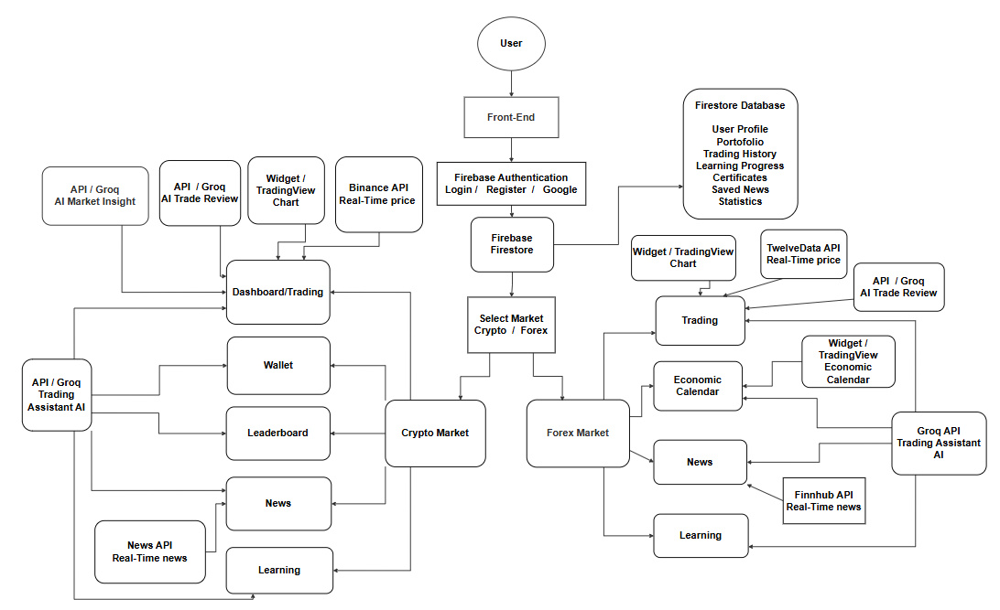

---

#  Educational Focus

The platform has been developed primarily as an educational tool.

Users can:

- Learn trading concepts
- Analyze real-time markets
- Practice trading strategies
- Improve decision-making skills
- Develop proper risk management techniques

without risking real capital.

---

#  Security

Security was one of the main considerations during the development of this platform.

To protect sensitive information and external services:

- API keys are **NOT exposed in the frontend**.
- All sensitive requests are handled through a secure backend server.
- The backend is deployed on **Render**, acting as a proxy between the client and external APIs.
- Firebase Authentication is used for secure user authentication.
- Firestore Security Rules ensure that users can only access their own data.
- Sensitive configuration values are stored as environment variables.

This architecture prevents API key exposure and follows modern web security best practices.

---

#  Secure Backend Server

A dedicated Express.js backend server is used to securely communicate with external services.

The backend is responsible for:

- Protecting API Keys
- AI requests (Groq API)
- Cryptocurrency News API
- Forex News API
- TwelveData REST API
- TwelveData WebSocket connection
- Real-time Forex price streaming
- Forwarding secure responses to the frontend

The backend is deployed on **Render**, ensuring that sensitive credentials remain hidden from the client application.

---

#  Responsive Design

The platform has been designed to provide a responsive experience across different screen sizes.

The interface is fully optimized for desktop and laptop devices, where users can comfortably access all trading, analysis, educational, and AI-powered features.

Due to the complexity and number of integrated modules, some sections may require additional optimization for smaller mobile screens. While the platform remains usable on mobile devices, the primary focus of this version is to deliver the best possible experience on larger displays.

Improving the mobile user experience and achieving full responsiveness across all devices is planned as part of future development.

---

#  Installation

Clone the repository:

```bash
git clone https://github.com/Endritfx/Real-Time-Trading-Platform-for-Forex-and-Cryptocurrency-Markets.git
```

Install dependencies:

```bash
npm install
```

Start the development server:

```bash
npm run dev
```

---


#  Screenshots

## Login 
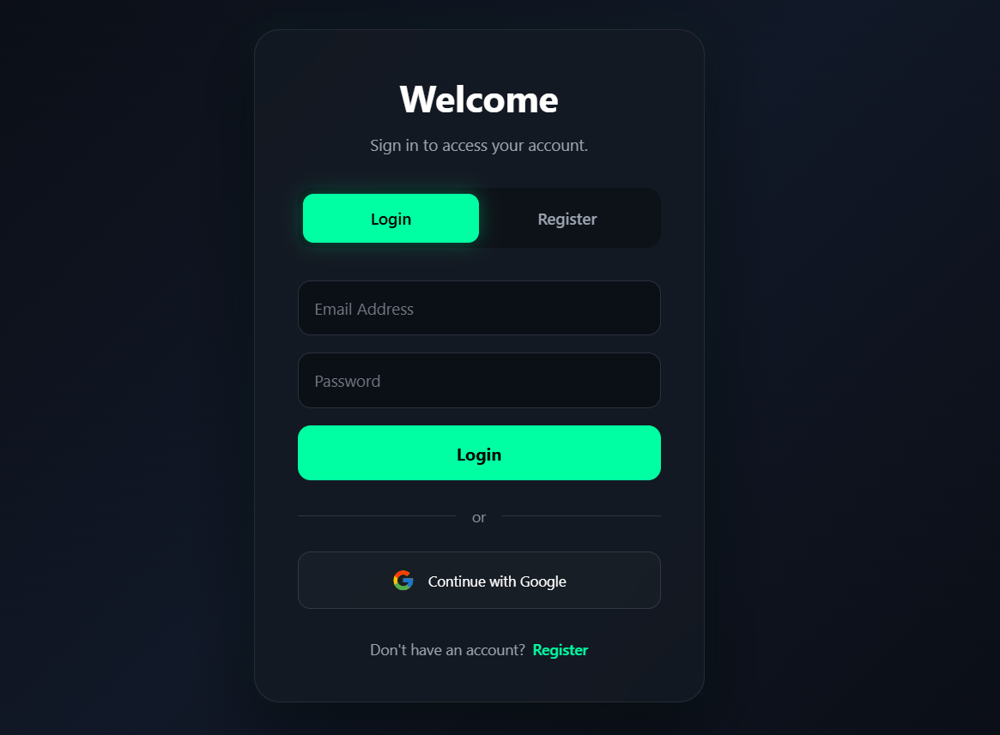

## Register 
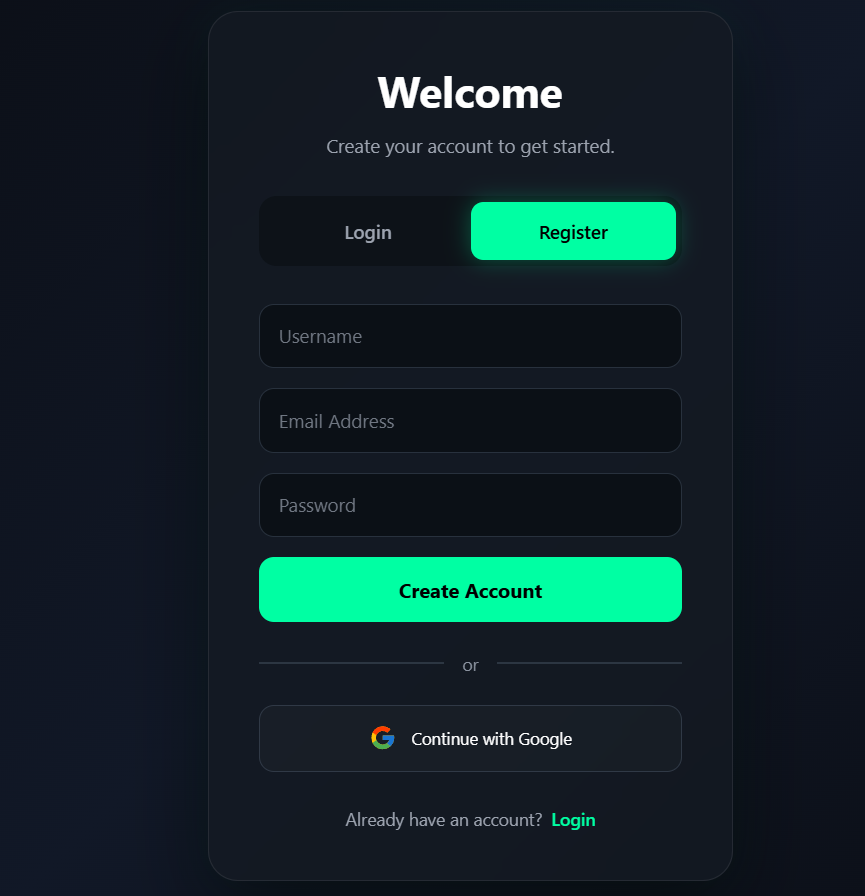

## Market Select


## Crypto Dashboard
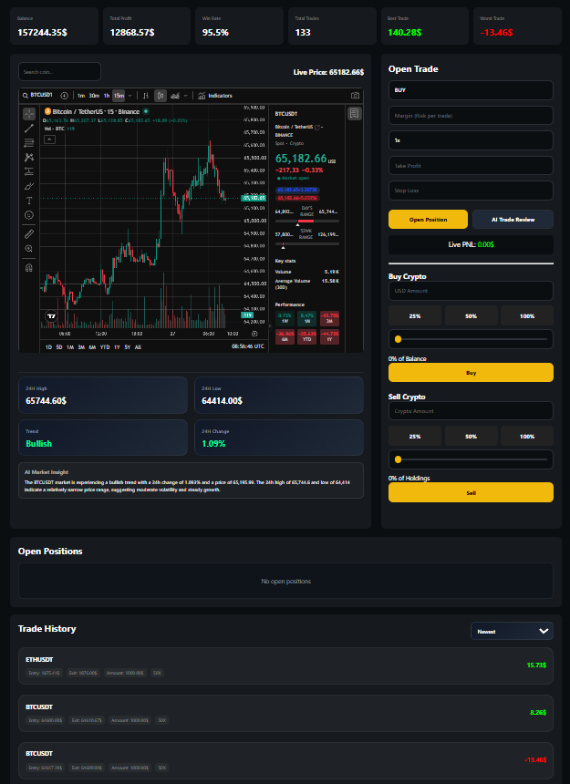

## Crypto Wallet
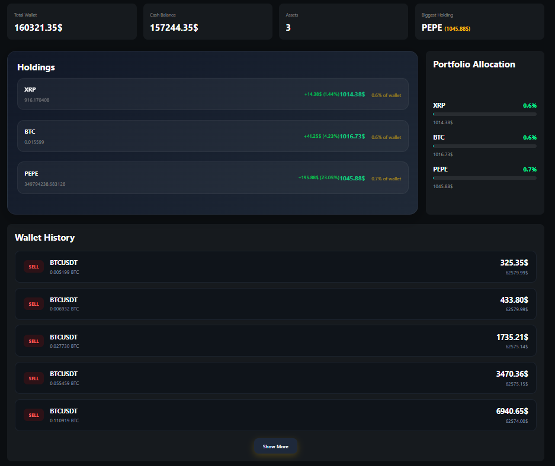

## Leaderboard
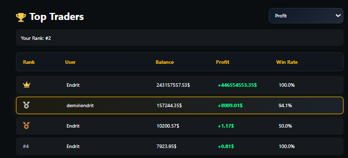

## Crypto News


## Crypto Learning
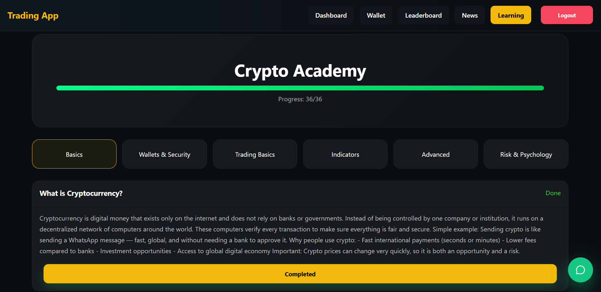

## Forex Dashboard
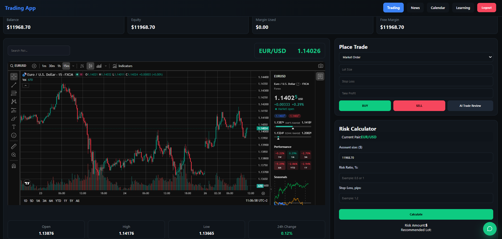

## Forex News
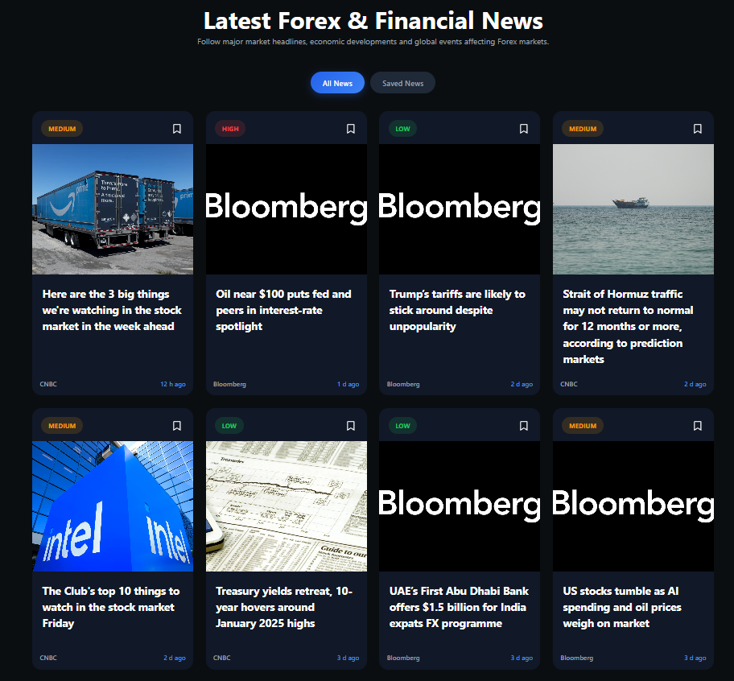

## Forex Economic Calendar
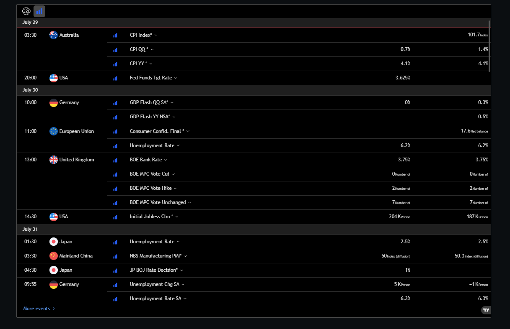

## Forex Learning
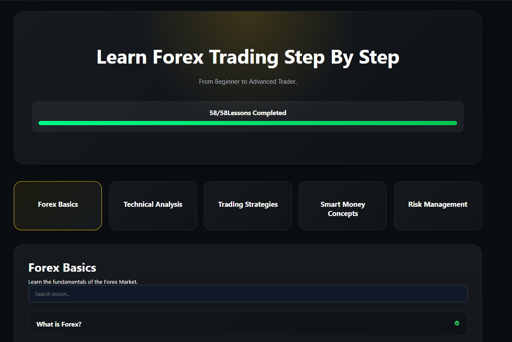

## Trading Assistant AI
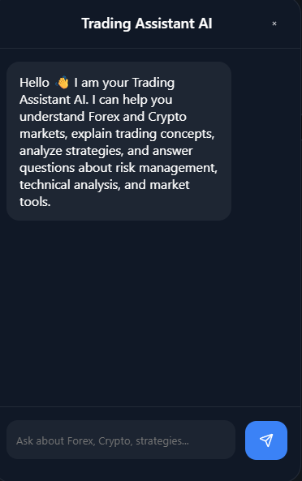

---

#  Future Improvements

Possible future enhancements include:

- Full mobile optimization for all modules.
- Mobile Application (Android & iOS)
- Advanced Technical Indicators
- Additional Financial Markets (Stocks, ETFs, Indices)
- More AI-powered trading analysis.
- Personalized AI Recommendations
- Community features for sharing trading ideas.
- Advanced Trading Statistics
- Cloud Synchronization
- Notification System

---

#  Live Deployment

The application is fully deployed and accessible online.

## Frontend

The React application is deployed using **Firebase Hosting**.

 Live Website:

https://trading-app-69a65.web.app/

---

## Backend

The secure backend API is deployed on **Render**.

The backend is responsible for:

- Protecting API Keys
- Communicating with external financial APIs
- Returning secure responses to the frontend
- Preventing sensitive credentials from being exposed

Deployment Platform:

- Render

#  Author

**Endrit Demiri**

Bachelor of Computer Science

---

#  Project Purpose

The primary goal of this project is to provide an integrated educational trading platform that combines all the essential tools required by beginner and intermediate traders within a single environment.

Instead of relying on multiple separate platforms for learning, market analysis, news, trading practice, and portfolio management, users can access everything in one place. The platform enables them to learn financial concepts, analyze real-time Forex and Cryptocurrency markets, practice trading strategies through paper trading, manage virtual portfolios, and receive AI-powered educational assistance.

By integrating financial education, real-time market data, trading simulation, portfolio management, financial news, economic events, and Artificial Intelligence, the platform creates a practical and interactive learning environment where users can continuously improve their trading knowledge, analytical skills, and decision-making without risking real capital.
